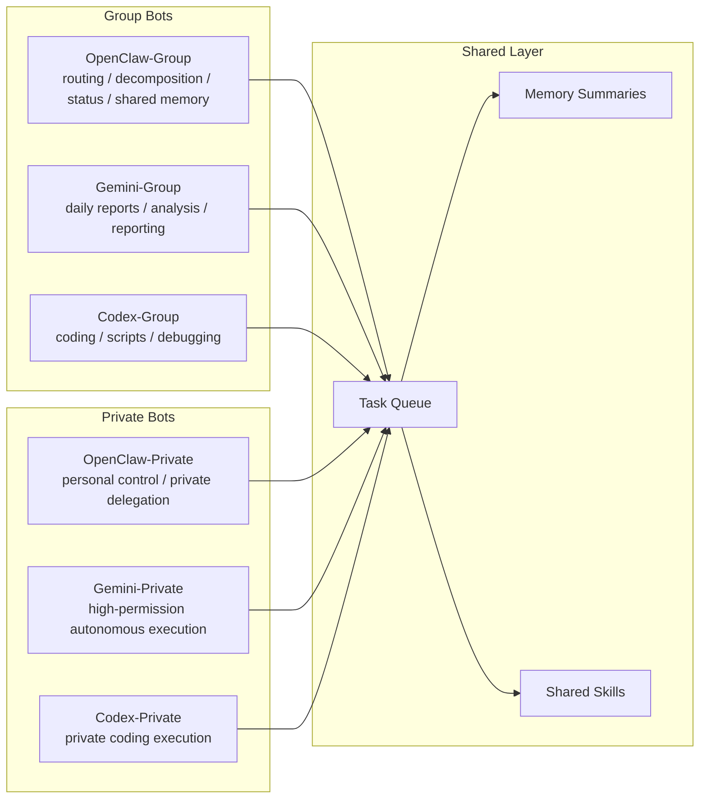

# Telegram Multi-Bot Stack

[](https://github.com/ukgorclawbot-stack/telegram-multi-bot-stack/actions/workflows/ci.yml)
[](https://github.com/ukgorclawbot-stack/telegram-multi-bot-stack/releases)

A Telegram multi-bot framework with:

- separated group bots and private bots
- multi-role collaboration across `OpenClaw / Gemini / Codex / Claude`
- shared task queue
- shared memory summaries
- one-command env and launchd generation
- flexible bot count scaling

This project is suitable for:

- task routing and reporting in team Telegram groups
- high-permission execution in private chat
- running multiple bots at once with clearly separated responsibilities

## Architecture



Language:

- Chinese: [README.md](./README.md)
- English: [README.en.md](./README.en.md)
- Chinese install: [INSTALL.md](./INSTALL.md)
- English install: [INSTALL.en.md](./INSTALL.en.md)
- Contributing: [CONTRIBUTING.md](./CONTRIBUTING.md)
- Security: [SECURITY.md](./SECURITY.md)
- Code of Conduct: [CODE_OF_CONDUCT.md](./CODE_OF_CONDUCT.md)
- FAQ: [docs/faq.md](./docs/faq.md)
- Changelog: [CHANGELOG.md](./CHANGELOG.md)

## Quick Start

```bash
git clone https://github.com/ukgorclawbot-stack/telegram-multi-bot-stack.git
cd telegram-multi-bot-stack
bash ./install.sh
bash ./configure.sh
bash ./apply_stack.sh
```

If you want a beginner-friendly walkthrough, read:

- [INSTALL.md](./INSTALL.md)
- [INSTALL.en.md](./INSTALL.en.md)

If you only want to preview generated files without starting services:

```bash
git clone https://github.com/ukgorclawbot-stack/telegram-multi-bot-stack.git
cd telegram-multi-bot-stack
bash ./install.sh
bash ./configure.sh
bash ./bootstrap_bot_stack.sh generate
```

## Core Files

- `group_bot.py`: shared entrypoint for group and private bot roles
- `bot.py`: compatibility entrypoint for legacy Codex direct handling
- `bootstrap_bot_stack.py`: generates env and launchd files from a TOML stack spec
- `configure_stack.py`: interactive configuration wizard
- `bootstrap_bot_stack.sh`: wrapper for generate/apply/export-live/migration-template
- `apply_stack.sh`: loads local tokens and applies the stack

## Common Commands

```bash
# Install dependencies
bash ./install.sh

# Run interactive configuration
bash ./configure.sh

# Generate files only, do not start services
bash ./bootstrap_bot_stack.sh generate

# Generate and start services
bash ./apply_stack.sh

# Run system health checks
bash ./health_check.sh
```

## Advanced Features

```bash
# Reverse export a live stack into a sanitized TOML file
bash ./bootstrap_bot_stack.sh export-live

# Build a migration-ready template for a fresh machine
bash ./bootstrap_bot_stack.sh migration-template
```

## License

MIT
