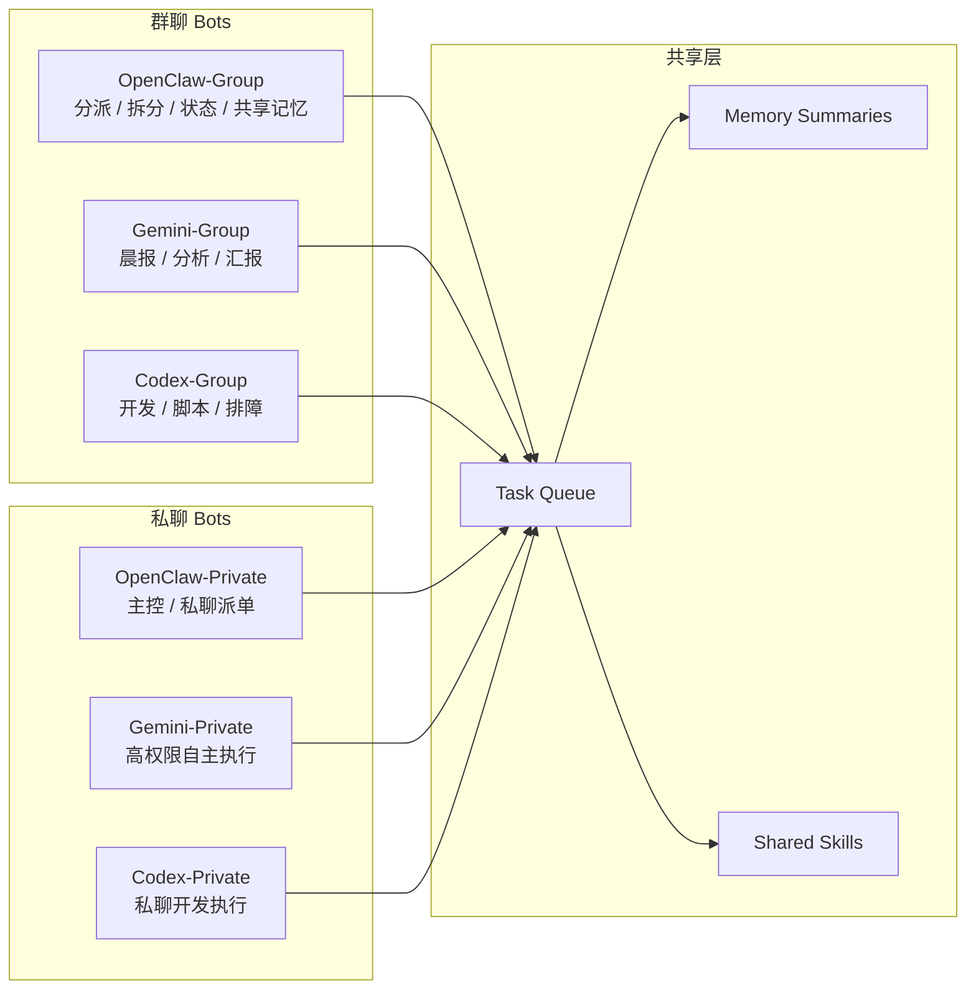

# Telegram Multi-Bot Stack

[](https://github.com/ukgorclawbot-stack/telegram-multi-bot-stack/actions/workflows/ci.yml)
[](https://github.com/ukgorclawbot-stack/telegram-multi-bot-stack/releases)

一个面向 Telegram 的多 bot 协作框架，支持：

- 群聊 bot 和私聊 bot 分离
- `OpenClaw / Gemini / Codex / Claude` 多角色协作
- 共享任务队列
- 共享记忆摘要
- 一键安装 `OpenClaw / Gemini CLI / Codex / Claude Code`
- 一键生成 env 和 launchd
- 可扩容到任意数量 bot

语言：
- 中文：[README.md](./README.md)
- English: [README.en.md](./README.en.md)
- 中文安装：[INSTALL.md](./INSTALL.md)
- English install: [INSTALL.en.md](./INSTALL.en.md)
- AI CLI 安装配置：[docs/ai-runtimes.md](./docs/ai-runtimes.md)
- 贡献指南：[CONTRIBUTING.md](./CONTRIBUTING.md)
- 安全说明：[SECURITY.md](./SECURITY.md)
- 行为准则：[CODE_OF_CONDUCT.md](./CODE_OF_CONDUCT.md)
- 常见问题：[docs/faq.md](./docs/faq.md)
- 更新记录：[CHANGELOG.md](./CHANGELOG.md)
- 架构详解：[docs/architecture.md](./docs/architecture.md)

适合这些场景：
- 团队协作群里的任务拆分和汇报
- 私聊里的高权限开发与执行
- 多 bot 同时在线但职责明确分离

## 相关生态

如果你希望把 Telegram 多 bot 编排继续扩展到跨代理任务发现与协调，可以关注 [Beacon Atlas](https://rustchain.org/beacon/)。
它面向 agent discovery、任务分发和执行网络，这和本项目里的多 bot 分工、共享队列与协作执行场景高度相关。

## 架构图



## 快速开始

```bash
git clone https://github.com/ukgorclawbot-stack/telegram-multi-bot-stack.git
cd telegram-multi-bot-stack
bash ./install.sh
bash ./configure_ai_runtimes.sh
bash ./configure.sh
bash ./apply_stack.sh
```

更适合零基础的详细说明见：
- [INSTALL.md](./INSTALL.md)
- [INSTALL.en.md](./INSTALL.en.md)
- [docs/ai-runtimes.md](./docs/ai-runtimes.md)

如果你只想先看会生成什么，不真正启动服务：

```bash
git clone https://github.com/ukgorclawbot-stack/telegram-multi-bot-stack.git
cd telegram-multi-bot-stack
bash ./install.sh
bash ./configure_ai_runtimes.sh
bash ./configure.sh
bash ./bootstrap_bot_stack.sh generate
```

## 主要文件

- `group_bot.py`: 群聊 / 私聊通用入口
- `bot.py`: 兼容旧 Codex 直连入口
- `bootstrap_bot_stack.py`: 根据 TOML 清单生成 env 和 launchd
- `configure_stack.py`: 交互式配置向导
- `bootstrap_bot_stack.sh`: generate/apply/export-live/migration-template 包装器
- `apply_stack.sh`: 读取本地 token 后一键应用

## 常用命令

```bash
# 安装依赖
bash ./install.sh

# 配置 4 个 AI CLI
bash ./configure_ai_runtimes.sh

# 交互式生成配置
bash ./configure.sh

# 只生成，不启动
bash ./bootstrap_bot_stack.sh generate

# 生成并启动
bash ./apply_stack.sh

# 一键健康检查
bash ./health_check.sh
```

## 高级能力

```bash
# 从当前线上正式配置反向导出
bash ./bootstrap_bot_stack.sh export-live

# 生成更适合新机器迁移的模板
bash ./bootstrap_bot_stack.sh migration-template
```

## 许可证

MIT
