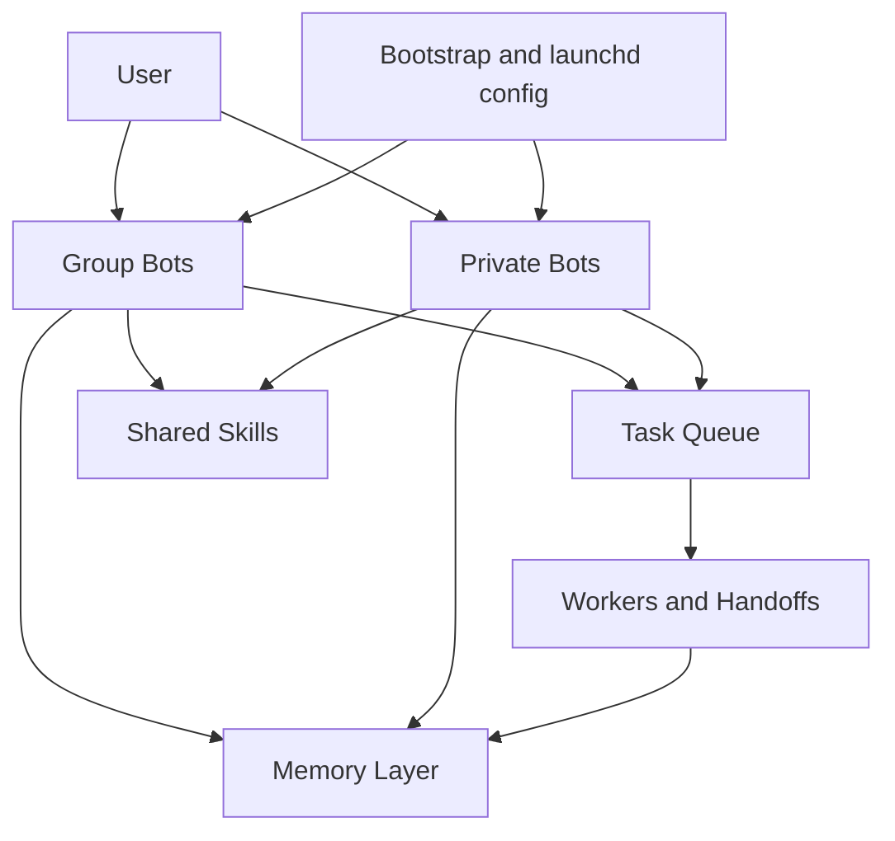

# Architecture

This document explains how the public Telegram Multi-Bot Stack is structured.

这份文档解释公开版 Telegram Multi-Bot Stack 的整体架构，以及它为什么要把群聊 bot 和私聊 bot 分开。

## 1. Design Goal / 设计目标

The stack is built for one practical goal:

- keep group collaboration stable
- keep private execution powerful
- let multiple bots share memory and skills without turning into one giant mixed process

这套系统追求的不是“一个 bot 什么都干”，而是：

- 群聊协作稳定
- 私聊执行强大
- 多 bot 共享记忆和技能
- 同时避免所有能力混在一个进程里互相污染

## 2. High-Level Model / 总体模型

The architecture is split into three layers:

- chat-facing bots
- shared runtime services
- reusable configuration and deployment tooling

架构分成三层：

- 面向聊天的 bot 层
- 共享运行时层
- 可复用的配置与部署工具层

## 3. Default 6-Bot Topology / 默认 6 Bot 拓扑

The public stack uses a default 6-bot layout because it is simple enough for first-time users, while still separating responsibilities cleanly.

公开版默认使用 6 个 bot，因为这已经足够把群聊和私聊彻底拆开，同时又不会让新手一上来就面对太多角色。

| Bot | Scene | Main responsibility | Typical work style |
|---|---|---|---|
| `OpenClaw-Group` | Group | routing, decomposition, status, shared memory write-back | coordinator |
| `Gemini-Group` | Group | daily report, research summary, analysis, reporting | analyst |
| `Codex-Group` | Group | coding, scripts, debugging, technical execution | builder |
| `OpenClaw-Private` | Private | personal control plane, explicit delegation, long-term memory entry | personal coordinator |
| `Gemini-Private` | Private | high-permission autonomous execution, research-to-action | deep executor |
| `Codex-Private` | Private | private coding execution, direct repository work | private engineer |

## 4. Why Split Group and Private Bots / 为什么要拆群聊和私聊

Mixing group chat and private chat into a single bot usually creates five problems:

- prompts drift between collaboration mode and private assistant mode
- one long private task can slow down group replies
- permission boundaries become harder to reason about
- fallback logic becomes messy
- memory gets polluted across scenes

把群聊和私聊混在一起，最容易出的问题就是：

- 提示词口径混乱
- 私聊长任务拖慢群聊
- 权限边界不清晰
- fallback 逻辑越来越难维护
- 记忆互相串线

This stack solves that by separating:

- token
- process
- launchd service
- env file
- default workdir

这套架构的核心思想就是：

- 群聊和私聊用不同 token
- 跑不同进程
- 用不同 launchd 服务
- 读不同 env
- 可以有不同默认工作目录

## 5. Routing Model / 路由模型

### 5.1 Group Chat

Typical group flow:

1. `OpenClaw-Group` receives an unassigned task-like message
2. it decomposes the request
3. it routes work to `Gemini-Group` or `Codex-Group`
4. the final outcome is written back into shared memory

群聊里的典型路径：

1. `OpenClaw-Group` 接住未点名任务
2. 先做拆分和判断
3. 再把任务分给 `Gemini-Group` 或 `Codex-Group`
4. 最终结果回写共享记忆

Typical non-task paths:

- digest-like queries can go directly to `Gemini-Group`
- casual messages can remain lightweight and not enter the task queue

非任务型消息通常是：

- 晨报/摘要类，直接给 `Gemini-Group`
- 闲聊类，不必进入任务队列

### 5.2 Private Chat

Typical private flow:

- private bots accept direct requests
- execution can be deeper and less constrained
- results can still be summarized into shared memory when needed

私聊里的典型路径：

- 私聊 bot 直接处理深度请求
- 执行能力更强、权限更大
- 但最后仍然可以把关键结论摘要写回共享记忆

## 6. Memory Model / 记忆模型

This stack is intentionally not built on raw chat history alone.

它不是靠原始聊天记录硬堆上下文，而是使用分层记忆。

### 6.1 Memory Layers

| Layer | Purpose | Sharing rule |
|---|---|---|
| Raw private memory | keep private dialog continuity | private only |
| Raw group memory | keep group context per bot | group only |
| Shared group memory | keep final outcomes and task history | shared across group bots |
| Instant memory summaries | keep recent short summaries for retrieval | shared as summaries |
| Daily memory | keep what happened today | shared |
| Long-term memory | store preferences, rules, stable decisions | usually controlled centrally |

### 6.2 Why Summaries Matter

Memory summaries make the system easier to scale because they:

- improve retrieval speed
- reduce prompt bloat
- make cross-bot recall practical
- lower the risk of copying private raw dialog into group contexts

记忆摘要的好处很直接：

- 更容易索引
- 更容易跨 bot 共享
- 不需要把整段原始对话都塞进 prompt
- 群聊和私聊更不容易互相污染

## 7. Shared Skills / 共享 Skill 层

Skills are treated as reusable capabilities, not bot-specific hacks.

skill 在这套架构里不是“某个 bot 的私有功能”，而是统一共享的能力层。

That means:

- install once, reuse many times
- keep logic out of giant prompt files when possible
- support future bots without rewriting existing workflows

也就是说：

- 装一次，多 bot 共用
- 尽量把复杂能力沉淀成 skill，而不是塞进大 prompt
- 以后就算新增 bot，也能直接复用原能力

## 8. Permission and Workdir Model / 权限与工作目录模型

The stack does not assume every bot should start from the same directory.

这套系统不要求所有 bot 都用同一个工作目录。

### 8.1 Common Pattern

- group bots often use a narrower workspace-oriented workdir
- private bots often use a broader home-directory workdir

常见默认模式是：

- 群聊 bot 更偏 workspace
- 私聊 bot 更偏 home 目录

### 8.2 Why This Matters

Different workdirs change:

- how relative paths resolve
- which repositories are discovered first
- how broad searches become
- how much accidental blast radius a bot has

工作目录不同，实际会影响：

- 相对路径解析
- 默认先命中哪个仓库
- 搜索范围大小
- 误操作风险范围

In short:

- narrower workdir = safer and more predictable
- broader workdir = more flexible and more powerful

简单理解就是：

- 收敛目录更稳
- 更大目录更自由

## 9. Runtime Components / 运行时组件

The stack usually relies on these runtime pieces:

- Telegram bot processes
- launchd services
- task registry
- memory store
- shared skill directories
- optional health-check scripts

运行时通常由这些部分组成：

- Telegram bot 进程
- launchd 服务
- 任务注册表
- 记忆存储层
- 共享 skill 目录
- 健康检查脚本

## 10. Config Generation Model / 配置生成模型

The public project is designed to be generated from a single declarative spec.

公开版项目的重点之一，是尽量从一份声明式配置生成整套运行文件。

Important pieces:

- `bot_stack.bootstrap.toml`
- generated env files
- generated launchd plist files
- generated stack summary files

关键文件通常包括：

- `bot_stack.bootstrap.toml`
- 生成出来的 env
- 生成出来的 launchd plist
- 生成出来的 stack summary

This lets the project support:

- one-click generation
- predictable rebuilds
- easier reviews
- safer migration between machines

这样就能支持：

- 一键生成
- 稳定重建
- 更容易审查配置差异
- 更容易迁移到新机器

## 11. Migration and Reverse Export / 迁移与反向导出

The stack supports two complementary directions:

- export a running live stack into a clean declarative summary
- turn that summary into a migration-ready template for another machine

这套工具支持两个方向：

- 从线上运行中的配置反向导出结构清单
- 再把清单加工成新机器可落地的迁移模板

This is useful because it gives you:

- a single source of truth for a live deployment
- a safer migration path
- easier backups for Git

它的价值在于：

- 把当前线上状态收敛成单一真相源
- 让迁移更可控
- 让 Git 备份更清晰

## 12. Operational Philosophy / 运维思路

This project prefers:

- multiple smaller, isolated services
- shared summaries instead of mixed raw history
- reusable skills instead of giant monolithic prompts
- generated config instead of hand-maintained sprawl

这套架构背后的运维思路是：

- 多个小而隔离的服务
- 共享摘要，而不是混合原始历史
- 共享 skill，而不是巨型 prompt
- 生成配置，而不是全靠手工维护

## 13. Recommended Reading Order / 建议阅读顺序

If you are new, read in this order:

1. `README.md` or `README.en.md`
2. `INSTALL.md` or `INSTALL.en.md`
3. `docs/faq.md`
4. this file
5. `CONTRIBUTING.md` and `SECURITY.md` if you plan to contribute
